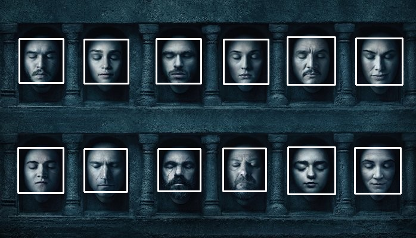
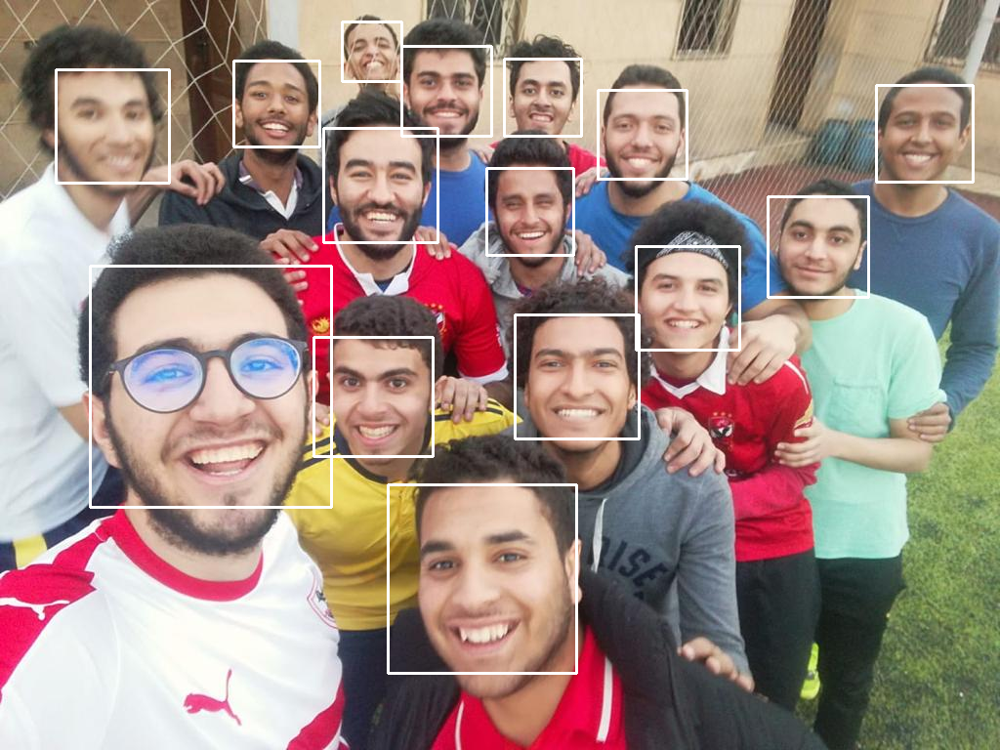

# Face-recognition-with-Eigen-Faces

# Computer Vision Course - Task #5

---

# Team Work:

| Name                    | Section | B.N Number   |
|-------------------------|---------|--------------|
| Tarek Mohamed Rashad    | 1       |           43 |
| Abdelrahman Abobakr     | 1       |           44 |
| Ammar Alsaed Mohamed    | 2       |            1 |
| Mostafa Mohamed Essam   | 2       |           28 |
| Mouaz Mohamed Hanfy     | 2       |           30 |

---
# Face Detection 

Face detection is a technique that identifies or locates human faces in digital images. A typical example of face detection occurs when we take photographs through our smartphones, and it instantly detects faces in the picture. Face detection is different from Face recognition. Face detection detects merely the presence of faces in an image while facial recognition involves identifying whose face it is.


Face detection is performed by using classifiers. A classifier is essentially an algorithm that decides whether a given image is positive(face) or negative(not a face). A classifier needs to be trained on thousands of images with and without faces. Fortunately, OpenCV already has two pre-trained face detection classifiers, which can readily be used in a program. The two classifiers are:
Haar Classifier (which is implemented in our code) and Local Binary Pattern(LBP) classifier.

[Haar feature-based cascade classifiers](https://medium.com/p/5c27e521c19a#4855)
* [1. 'Haar features' extraction](https://medium.com/p/5c27e521c19a#357a)
* [2. 'Integral Images' concept](https://medium.com/p/5c27e521c19a#357a)
* [3. 'Adaboost': to improve classifier accuracy](https://medium.com/p/5c27e521c19a#9391)
* [4. Using 'Cascade of Classifiers'](https://medium.com/p/5c27e521c19a#93)
[Face Detection with OpenCV-Python](https://levelup.gitconnected.com/face-detection-with-python-using-opencv-5c27e521c19a#a843)

---
## Understanding the Code
1. You pass in the image and cascade names as command-line arguments. We’ll use the SBME22 image as well as the default cascade for detecting faces provided by OpenCV.
```
 imagePath = "Images/GOT.jpg"
 cascPath = "haarcascade_frontalface_default.xml"
```

2. Now we create the cascade and initialize it with our face cascade. This loads the face cascade into memory so it’s ready for use. Remember, the cascade is just an XML file that contains the data to detect faces.
```
faceCascade = cv2.CascadeClassifier(cascPath)
```

3. Here we read the image and convert it to grayscale.
```
image = cv2.imread(imagePath)
gray = cv2.cvtColor(image, cv2.COLOR_BGR2GRAY)
```

4. This function detects the actual face and is the key part of our code, so let’s go over the options:
* The detectMultiScale function is a general function that detects objects. Since we are calling it on the face cascade, that’s what it detects.

* The first option is the grayscale image.

* The second is the scaleFactor. Since some faces may be closer to the camera, they would appear bigger than the faces in the back. The scale factor compensates for this.

* The detection algorithm uses a moving window to detect objects. minNeighbors defines how many objects are detected near the current one before it declares the face found. minSize, meanwhile, gives the size of each window.
```
faces = faceCascade.detectMultiScale(
    gray,
    scaleFactor=1.1,
    minNeighbors=5,
    minSize=(30, 30),
    flags = cv2.cv.CV_HAAR_SCALE_IMAGE
)
```
> The function returns a list of rectangles in which it believes it found a face. Next, we will loop over where it thinks it found something.

5. This function returns 4 values: the x and y location of the rectangle, and the rectangle’s width and height (w , h).
We use these values to draw a rectangle using the built-in rectangle() function.

```
print "Found {0} faces!".format(len(faces))

# Draw a rectangle around the faces
for (x, y, w, h) in faces:
    cv2.rectangle(image, (x, y), (x+w, y+h), (0, 255, 0), 2)
```

### Testing
Let’s test against the GOT photo:

Input image 


Resulted image after detecting faces 


another test against SBME22 photo:

Resulted image after detecting faces 



## Face Recognition

---
### introduction

The objective of this project is to highlight the importance of linear algebra in the field of computer vision and face recognition. Eigenface is the name of a set of eigenvectors computed from an image dataset. Eigenvectors is a set of features which characterize the global variation among face images.The basis of the eigenfaces method is the Principal Component Analysis (PCA).PCA is a dimensionality-reduction method that is often used to reduce the dimensionality of large data sets, by transforming a large set of variables into a smaller one that still contains most of the information in the large set.

### Algorithm

* first of all we Obtain face image and represent every image in a n^2 x m matrix Image.
* Compute the pixel-wise-Mean face vector(m).
* Then subtract the mean from each image.
* Compute the eigen vectors of the covariance matrix of the data matrix.
* Select q eigenvectors.
* project images into eigenvectors.
* The images will be represented using the q eigenvectors.
* Face Detection
    * use the training dataset to obtain the eigen vectors.
    * project train and test data onto the selected vectors.
    * use the reduced train and test matrices to train an SVM classifier.